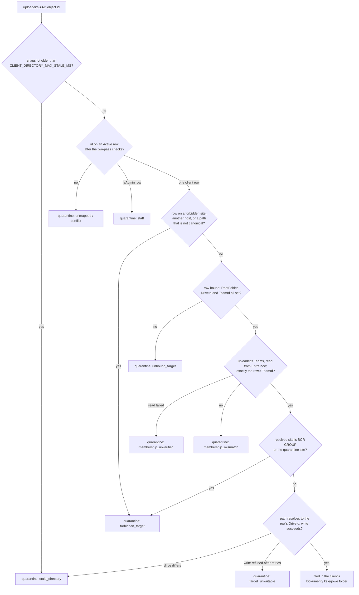

# Architecture

> **Phase 0 of v2 (September 2026).** This page describes the routing after the Phase-0
> containment: the client comes from the uploader's identity only, and anything that cannot be
> tied to exactly one client goes to a staff-only quarantine. Sections that describe behaviour
> Phase 0 removed are kept, collapsed and marked **as-is before v2 (Sep 2026)**, because
> incident [`IR-2026-09`](docs/operations/incident-2026-09.md) needs a record of how the system
> used to behave. Do not build on them.

## 1. Goals and non-goals

**Goals**

- Conversational document intake in Microsoft Teams, in a 1:1 chat with the bot.
- **The document's content chooses the folder; the uploader's identity chooses the client.**
  Each document is classified by **Claude** (Anthropic API), with a deterministic fallback to a
  manual-review folder when confidence is low. Content never chooses whose space a document goes
  to.
- A client never reaches another client's documents. Anything ambiguous goes to quarantine,
  never to a guess.
- Fully managed, serverless Azure footprint: no VMs, no Kubernetes.
- Strict separation of concerns. The **bot** never touches SharePoint or the classifier directly;
  it only forwards work to an authenticated internal API.
- Zero secrets in source. Secrets are in Key Vault and referenced from Function App settings.

**Non-goals**

- A generic chatbot framework. This agent has exactly one skill: *"take this file and file it"*.
- Long-running workflows. Moving uploads to a queue is planned (v2 Phase 3).

---

## 2. Component overview

| Component | Tech | Hosting |
|---|---|---|
| Teams Bot | Bot Framework SDK v4 (JS) | Azure Functions (Node 22, HTTP trigger) |
| Document Ingestion API | TypeScript + Azure Functions v4 programming model | Azure Functions (Node 22, HTTP trigger) |
| Shared library | TypeScript | Yarn workspace |
| Channel registration | Azure Bot Service | Microsoft.BotService |
| Secrets | Azure Key Vault | Microsoft.KeyVault |
| Document classification | Claude (Anthropic Messages API) | api.anthropic.com (external) |
| Routing directory | "Client Directory" SharePoint list on the BCR GROUP site | Microsoft 365 tenant |
| File store | Each client's Team site, channel "Dokumenty księgowe" (Microsoft Graph) | Microsoft 365 tenant |
| Quarantine | "BCR Ledger – Kwarantanna" communication site, staff only | Microsoft 365 tenant |
| Telemetry | Application Insights | Microsoft.Insights |
| Infrastructure as code | Bicep | `infrastructure/` |

---

## 3. Sequence: happy path (Phase 0)

```mermaid
sequenceDiagram
  actor U as Client guest (Teams)
  participant BS as Azure Bot Service
  participant FB as Bot Function App
  participant FI as Ingestion Function App
  participant CD as Client Directory (SharePoint list)
  participant CL as Claude (Anthropic API)
  participant SP as SharePoint (via Graph, ingestion MI)

  U->>BS: 1:1 chat: Faktura_03_2026.pdf
  BS->>FB: POST /api/messages (JWT signed by Bot Framework)
  FB->>FB: gate: personal chat? BCR tenant? GUID aadObjectId?
  Note over FB: refused → no download, no ingestion call
  FB->>BS: GET each attachment (in parallel)
  FB->>FI: POST /api/ingest/batch (Bearer token; source.conversationType = personal)
  FI->>FI: JWT: issuer, audience, role, caller app id ∈ BOT_CALLER_APP_IDS
  FI->>FI: strict source: personal, UUID user id, BCR tenant
  FI->>CD: snapshot (5 min cache; empty if older than 15 min)
  FI->>FI: resolve(userAadObjectId) → directory client, or quarantine + reason
  loop each document
    FI->>CL: classify (primed with the bound client's NIP and name, if any)
    CL-->>FI: category, year/month, confidence, parties[]
    FI->>FI: bound client only: flip sprzedaż ⇄ zakup from the parties
    alt bound to exactly one client
      FI->>SP: PUT <RootFolder>/<category path>/<name> (conflictBehavior=fail)
    else quarantine, or the client's site refuses the write
      FI->>SP: PUT Kwarantanna/YYYY/MM/<batchId>/<name> on the quarantine site
      FI->>SP: PATCH item fields: UploaderOid, QuarantineReason, OriginalFilename, DocumentId
    end
  end
  FI-->>FB: 200 { results[]: uploaded | quarantined | rejected }
  FB-->>U: one card: Dokument · Kategoria · Folder; quarantined rows carry no link
```

**Bot delivery model.** Only 1:1 chats deliver file attachments to a bot. Files posted in a
channel bypass the bot (drag-drop), or arrive as mention HTML with no file. Manifest 0.2.0 has
`"scopes": ["personal"]` only, and the gate refuses any other conversation type from older
installs.

<details>
<summary>As-is before v2 (Sep 2026): the pre-Phase-0 sequence</summary>

```mermaid
sequenceDiagram
  actor U as User (Teams)
  participant FB as Bot Function App
  participant FI as Ingestion Function App
  participant CD as Client Directory
  participant CL as Claude
  participant SP as SharePoint

  U->>FB: DM with attachments (any conversation type, any tenant)
  FB->>FI: POST /api/ingest/batch
  FI->>CD: getSnapshot(): byNip / byUserAadObjectId maps
  FI->>FI: resolve(userAadObjectId) → client, or the fallback bucket (BCR GROUP library root)
  loop each document
    FI->>CL: classify
    CL-->>FI: category + confidence + reasoning + parties[]
    FI->>FI: resolvePostClassification: promote fallback → client on party NIP match; flip direction
    FI->>SP: probe for a free name, then PUT into the resolved (or promoted) client's site
  end
  FB-->>U: card with folder, confidence and the model's reasoning, plus a link per file
```

A single-document route, `POST /api/ingest`, also existed. Phase 0 deleted it.

</details>

---

## 4. Classification pipeline

Ingestion passes every file through an ordered list of `Classifier` strategies. The first one
that returns a match wins, and the fallback always succeeds last.

1. **`ClaudeClassifier`** ([`claudeClassifier.ts`](./packages/document-ingestion/src/services/claudeClassifier.ts)).
   It sends the document **content** to the Anthropic Messages API: PDF as a `document` block,
   images as `image`, text as `text`. It comes with a tool whose `input_schema` is generated from
   the folder taxonomy ([`folderTaxonomy.ts`](./packages/shared/src/parsers/folderTaxonomy.ts)).
   The model returns a `category`, optional `year`/`month`, a `confidence`, and optional
   `parties[]` (seller, buyer, issuer, recipient, each with NIP and name). The category maps to a
   literal path through `buildFolderPath`; `dated` categories get a `YYYY/MM` leaf.

   When the uploader is bound to a client, that client's NIP and name are passed per call through
   `ClassifierContext.client`. The model can then decide invoice direction (sales or purchase)
   directly. When the upload is going to quarantine, no client identity is passed, and nothing is
   flipped.

   The classifier **never throws**. An unsupported type, an oversized file
   (`ANTHROPIC_MAX_CONTENT_BYTES`), confidence below `ANTHROPIC_CONFIDENCE_THRESHOLD`, an unknown
   category or an API error all return `null`, and the fallback runs. The classifier is off when
   `ANTHROPIC_ENABLED=false` or when there is no key.
2. **`FallbackClassifier`**: `98_Nieposortowane/<YYYY>/<MM>/`. It always succeeds, so the user
   never gets a *"nowhere to put this"* error, and the file goes to manual review **inside the
   client's own space**.

To add or change a category, edit the single `categoryCatalog` in
[`folderTaxonomy.ts`](./packages/shared/src/parsers/folderTaxonomy.ts) and add a unit test. The
Claude prompt, the tool schema and the fallback all derive from it.

### 4.1 Batch ingestion

When one Teams message carries several attachments,
[`LedgerBot`](./packages/teams-bot/src/bot/ledgerBot.ts) downloads them all in parallel and
sends them in **one** call to `POST /api/ingest/batch`
([`ingestDocument.ts`](./packages/document-ingestion/src/functions/ingestDocument.ts)).

- **Request:** `{ documents: IngestionDocument[], source }`, with one `source` for the whole
  activity. It is validated by `validateBatchIngestionPayload`:
  - at most **25** documents and **100 MiB** decoded;
  - `source.conversationType` must be `personal`;
  - `source.userAadObjectId` must be a UUID;
  - `source.tenantId` must equal `AZURE_TENANT_ID`.
- **Processing:** each document goes through the pipeline on its own. A failure on one document
  becomes a `rejected` item **without aborting the batch**.
- **Response:** `{ status: 'completed', results: IngestionBatchItemResult[] }`. Each item is one
  of three kinds:
  - `uploaded`: with the drive item, the folder, and `classification` (`documentType`,
    `categoryId`, `confidence`, `classifier`). There is no free-text reasoning;
  - `quarantined`: with **no** result at all. No URL, folder, stored name or client name;
  - `rejected`: with an error code.
- **Presentation:** one Adaptive Card, built in
  [`responseBuilder.ts`](./packages/teams-bot/src/bot/responseBuilder.ts).
  - **Uploaded** rows show **Dokument · Kategoria · Folder**, with an "Otwórz" action into the
    client's own space.
  - **Quarantined** rows show "📨 {file name}" and "Dokument przekazano do weryfikacji przez
    zespół BCR.", with no link.
  - **Rejected** rows show a fixed Polish message chosen by error code, never the error's text.

  Every inserted value goes through `escapeMarkdown()`
  ([`cardText.ts`](./packages/teams-bot/src/bot/cardText.ts)). The model's reasoning is never
  shown, because document content could steer it.

The shared contracts are in [`packages/shared/src/types/bot.ts`](./packages/shared/src/types/bot.ts).

### 4.2 Client routing (Phase 0: identity only)

One deployment files documents for many clients. Which client a document belongs to is decided
**once, from the uploader's identity, before classification**, and nothing after that can change
it.



#### The Client Directory

This is a SharePoint list on the BCR GROUP site, with one row per client. The admin guide,
[`docs/client-directory-admin-guide.md`](./docs/client-directory-admin-guide.md), describes the
columns and the rules for maintaining them. What matters for routing:

- **`UserAadObjectIds`** holds the client's own guests only, and never staff.
- The target is **`SiteHostname`**, **`SitePath`**, **`DriveName`** and **`RootFolder`**.
  `RootFolder` is the "Dokumenty księgowe" channel folder, as Graph's `filesFolder` names it.
  `SiteHostname` must equal `QUARANTINE_SITE_HOSTNAME`, the tenant's only SharePoint host, and
  `SitePath` must be canonical (below).
- **`DriveId`**: the resolved drive must have this id.
- **`TeamId`**: the client's Team. Two rows may not share it, and it is logged (`teamId`) on the
  routing line and on `document.filed`. An upload routes only while it is the uploader's one and
  only Team (below).
- **A row routes only once it is bound**: `RootFolder`, `DriveId` and `TeamId` all set. A user
  whose only row lacks any of them is quarantined as `unbound_target`. Only
  `tools/directory-bindings.mjs apply` binds a row, and it always writes the three together, so a
  row that onboarding wrote, or that somebody filled in by hand, routes nobody until the tool has
  bound it after a person's review. Before this rule, a row with no `RootFolder` filed into the
  library root (incident root cause R5).
- **`IsAdmin`** marks the staff row, and **`Status`** must be `Active` for a row to route.

The routing fields are written by `tools/directory-bindings.mjs` from Graph, not typed by hand.
`NIP` is used only to decide invoice direction inside the bound client.

The tool binds a guest only if the row's Team is the only Team they belong to, and ingestion
checks the same thing again **at upload time** (R46). After the uploader resolves to a bound row,
[`TeamMembershipReader`](./packages/document-ingestion/src/services/teamMembership.ts) reads
their direct memberships from Entra
(`GET /users/{id}/memberOf?$select=id,description,resourceProvisioningOptions`, every page) and
keeps the groups that are Teams, by the tool's rule: `resourceProvisioningOptions` contains
`Team`, or the description carries onboarding's `BCR Group —` marker, or the options come back
missing (an unknown counts as a Team). Directory roles and administrative units are skipped. The
upload routes only if that set is exactly `{TeamId}`, compared case-insensitively. Otherwise it
goes to quarantine:

- `membership_mismatch`: the set was read and differs. The uploader is not in the row's Team, or
  is also in another Team, such as a guest bound to client A who was later added to client B's
  Team. Before this check that guest's uploads, B's documents included, kept filing into A until
  the plan was applied again.
- `membership_unverified`: the set could not be read after retries (no grant, the grant not yet
  in the identity's token, the user gone, Graph down). A failure is never cached.

A successful read is cached per user for 5 minutes, so a Team joined since shows up on the next
upload after that. Staff and uploads that are already quarantined are not read. The log events
are `membership.mismatch` and `membership.unverified`, with `clientId`, `listItemId`, `teamId` and
counts only (`teamCount`, `inRowTeam`, `otherTeamCount`, or Graph's `status`): never another
Team's id or name.

Why `memberOf` and not `/users/{id}/joinedTeams`, which needs only `Team.ReadBasic.All`:
onboarding adds a guest to a Team through its group (`POST /groups/{id}/members/$ref`), and
Microsoft documents that a member added outside Teams "can take up to 24 hours" to be reflected
in Teams ([Microsoft 365 Groups and Teams](https://learn.microsoft.com/en-us/microsoftteams/office-365-groups#group-membership)).
`joinedTeams` reads Teams, so it could miss the second Team for a day, the very window the check
closes. Entra has the membership as soon as it is written, and the binding tool already reads it
the same way, so the two agree. The OData cast `memberOf/microsoft.graph.group` is not used: it
requires `ConsistencyLevel: eventual`, an index that can lag recent changes. The cost is the
permission (§5.3).

`MEMBERSHIP_CHECK_MODE=off` switches the check off. It is an emergency escape only: it reopens
R46, logs `membership.check_off` at every cold start, and shows as `build.membershipCheck: "off"`
in `/api/health`. The binding tool's weekly `check` stays as defence in depth: it reports the
same drift for every bound row, including guests who have not uploaded since. One gap is shared
by both: Microsoft notes that "certain unused old teams will not have resourceProvisioningOptions
set", and such a Team without the onboarding marker is not counted by either. The operating rule
is in the admin guide's
[Keeping the bindings current](./docs/client-directory-admin-guide.md#keeping-the-bindings-current).

**Canonical site path.** A `SitePath`, `QUARANTINE_SITE_PATH` and every
`FORBIDDEN_TARGET_SITE_PATHS` entry are read the same way: trim the string, split it on `/`, and
drop empty segments. The path is canonical only if exactly two segments remain: `sites` or `teams`
(any case), then a name that starts with a letter, digit, `_` or `-`, continues with those or `.`,
and does not end with `.`. Its canonical form is `/<first>/<second>`, and every comparison is in
lower case. So `/sites/A/`, `sites/A` and `//sites//A` all mean `/sites/a`. A sub-site
(`/sites/A/x`), a `.` or `..` segment, `%`, `\`, or whitespace inside the name is **not**
canonical: such a row is excluded as `forbidden_target`, and such a setting fails at cold start.
Graph and the HTTP layer resolve spellings that a string comparison does not, so anything
ambiguous is refused rather than normalised. `canonicalSitePath` in ingestion and the site-path
check in `tools/lib/bindings.mjs` (`site_path_not_canonical`) implement the same rule, against
the same table of edge cases in their tests.

[`ClientDirectoryReader`](./packages/document-ingestion/src/services/clientDirectoryReader.ts)
reads the list, follows pagination, and caches the snapshot for `CLIENT_DIRECTORY_CACHE_TTL_MS`
(default 5 minutes). It builds the snapshot in **two passes**, so the result does not depend on
row order:

- **Pass 1** collects, for each key, every row that has it. The keys are the user id, the site
  (host + canonical path), the `DriveId`, the `TeamId`, the ClientId and the NIP.
- **Pass 2** applies these rules:
  - a user id on two rows is dropped from routing (`conflict`). The rows stay usable for everyone
    else;
  - two Active client rows on the same site, whatever `DriveName` or `RootFolder` each names, or
    with the same `DriveId` or the same `TeamId` (compared case-insensitively), are **all**
    excluded, and their users are quarantined as `conflict`. One Team, its site and its drive
    belong to one client;
  - a ClientId or NIP on two rows only raises `directory.conflict`, because neither routes
    anything;
  - a row is excluded as `forbidden_target` when its `SiteHostname` is not
    `QUARANTINE_SITE_HOSTNAME`, its `SitePath` is not canonical, or its site is in
    `FORBIDDEN_TARGET_SITE_PATHS` (BCR GROUP) or is the quarantine site, which is added
    automatically.
- **Stale cap.** If refreshes keep failing, a snapshot older than `CLIENT_DIRECTORY_MAX_STALE_MS`
  (default 15 minutes) counts as empty, so every upload goes to quarantine.

There are no name maps. The alias and person-name lookups were only ever used for content
matching, and are deleted.

#### Resolution

[`ClientResolver.resolve(source)`](./packages/document-ingestion/src/services/clientResolver.ts)
returns `source: 'directory'` for exactly one bound client row whose Team is the uploader's only
Team, and logs the routing with ids only (`clientId`, `listItemId`, `teamId`, and
`membership: verified`, or `unchecked` when `MEMBERSHIP_CHECK_MODE=off`). Otherwise it returns
`source: 'quarantine'` with a `quarantineReason`: `unmapped`, `staff`, `conflict`,
`stale_directory`, `forbidden_target`, `unbound_target`, `membership_mismatch` or
`membership_unverified`. The upload step can add `target_unwritable`, and `forbidden_target` when
the row's site resolves to BCR GROUP or the quarantine site.

After classification, `resolvePostClassification` does exactly one thing, and only for a
`directory` client. If that client's NIP is on the invoice as seller or buyer, it sets the
direction (`faktury_sprzedazy` ⇄ `faktury_zakupu`) and rebuilds the folder path. It never
changes the client. A source-scan test fails the build if a path from a NIP to a client comes
back.

#### Quarantine

The quarantine site is a SharePoint communication site. It has no Microsoft 365 group, unique
permissions for the triage staff, and sharing disabled. It is configured by
`QUARANTINE_SITE_HOSTNAME`, `QUARANTINE_SITE_PATH`, `QUARANTINE_DRIVE_NAME` (`Dokumenty` on this
tenant) and `QUARANTINE_ROOT_FOLDER` (default `Kwarantanna`). `QUARANTINE_SITE_HOSTNAME` doubles
as the tenant's SharePoint host: it must look like `<tenant>.sharepoint.com`, and a Directory row
naming any other host routes nobody.

- A file goes to `Kwarantanna/YYYY/MM/<batchId>/<sanitised original name>`.
- Ingestion then PATCHes the list item's `UploaderOid`, `QuarantineReason`, `OriginalFilename`
  and `DocumentId`. Staff decide the owner from those fields, not from the content.
- If the bound client's site refuses the write after retries, the file goes to quarantine as
  `target_unwritable`. If the quarantine write fails too, the item is `rejected`, the user is
  asked to try again, and an error is logged.

**A document is never written anywhere else.**

#### Per-client SharePoint services

[`SharePointServiceFactory`](./packages/document-ingestion/src/services/sharePointServiceFactory.ts)
keeps one `SharePointService` per target, so site and drive resolution happens once per target.
Uploads use `@microsoft.graph.conflictBehavior=fail`. If the name is taken, they retry with
`_1` to `_10`, without probing first. Every path segment is sanitised and then
`encodeURIComponent`-ed.

- **Resolved-site guard.** A path check compares spellings; this compares what Graph resolved.
  Before writing a client document, the service compares the resolved site's site-collection id
  with BCR GROUP's (from `CLIENT_DIRECTORY_SITE_ID`) and with the quarantine site's (resolved
  once from `QUARANTINE_SITE_HOSTNAME` and `QUARANTINE_SITE_PATH`, then cached; if it cannot be
  resolved, the write is refused). A match throws `SharePointTargetError` of kind
  `forbidden_site`, is logged as `sharepoint.forbidden_site` with ids only, and the document goes
  to quarantine as `forbidden_target`. The quarantine target itself is checked against BCR GROUP
  only.
- **Retries.** The service's own retry (`withRetry`, bounded exponential back-off with jitter)
  covers only network failures (no HTTP status), 500 and 502. 429, 503 and 504 are left to the
  Graph SDK's `RetryHandler`, which honours `Retry-After`; the two layers never retry the same
  failure, so their delays do not multiply.
- **Batch deadline.** A batch has 150 s from its start, inside the platform's 230 s HTTP limit. A
  document not started by then comes back `rejected` with a generic "try again" code; it is
  never uploaded late.
- **Possible duplicate.** A PUT that failed on the network may still have landed. If its retry
  then meets a 409 and takes a suffixed name, the same document may now be stored twice; that is
  logged as `sharepoint.possible_duplicate`, with ids only, for staff to check.

<details>
<summary>As-is before v2 (Sep 2026): two-phase resolution, promotion and the fallback bucket</summary>

This behaviour caused incident IR-2026-09 and is **deleted**. It is recorded here only so that
the incident's evidence can be read.

- **Phase 1, before classification:** `resolve(source)` looked the uploader up in
  `byUserAadObjectId`. A non-admin match was the destination. An admin match, or no match,
  returned the **fallback bucket**: the BCR GROUP site's `Dokumenty` library root, configured by
  `FALLBACK_SITE_HOSTNAME`, `FALLBACK_SITE_PATH`, `FALLBACK_DRIVE_NAME`, `FALLBACK_ROOT_FOLDER`
  and `FALLBACK_CLIENT_ID`. Every member of BCR GROUP could read it.
- **Phase 2, after classification:** `resolvePostClassification` **promoted** a fallback upload
  to a Directory client when exactly one `parties[].nip` matched that client's NIP, in any role,
  whoever had uploaded it. It then flipped invoice direction.
- **The reader** built `byNip`, `byCompanyAlias`, `byPersonName` and `byUserAadObjectId` in one
  pass. Its duplicate check deleted a key on the second row and re-added it on the third, and a
  failed refresh kept the last snapshot forever.
- **Uploads** probed for a free `_n` name with a GET and then PUT. Two uploads could race, and
  the second overwrote the first.
- **Onboarding** wrote rows with `RootFolder = ''` and no user ids. So onboarded clients' uploads
  were all unmapped, went to the fallback bucket, and were then promoted by content.

</details>

### 4.3 Personal Tab "Moje dokumenty" (removed)

Phase 0 removed the tab. Manifest 0.2.0 has no `staticTabs`. `/api/mydocs` returns a static page
that tells the user where their documents are (their team → "Dokumenty księgowe"), and
`/api/user-target` is deleted. Clients find their files in their own Team.

<details>
<summary>As-is before v2 (Sep 2026): the tab and its IDOR</summary>

- The manifest's `staticTabs` loaded `GET /api/mydocs?userObjectId={userObjectId}&theme={theme}`
  on the bot, **anonymously**.
- The bot passed the `userObjectId` from the URL to ingestion's `GET /api/user-target`, which
  returned the resolved client's `{clientId, title, siteHostname, sitePath, driveName,
  sharepointWebUrl}`.
- The page showed the client's name and a link to its library.

Because the id came from the query string and nothing checked who was asking, anyone on the
internet could map any user id to that user's client and SharePoint location. This is threat
T7 in [`docs/security.md`](./docs/security.md).

</details>

---

## 5. Auth model

### 5.1 Teams → bot

Standard Bot Framework JWT, validated by `CloudAdapter` with the bot's `MicrosoftAppId`,
`MicrosoftAppPassword` and `MicrosoftAppTenantId`. `MICROSOFT_APP_TYPE` is required and is
`SingleTenant`.

After authentication, a **gate middleware** runs on every activity type: messages, invokes
(Adaptive Card actions, file consent), conversation and installation updates, edits and
reactions. An activity passes only if all three hold:

- `conversation.conversationType` is `personal`;
- the tenant (`channelData.tenant.id`, else `conversation.tenantId`) equals
  `MICROSOFT_APP_TENANT_ID`;
- `from.aadObjectId` is a GUID.

Every refusal is logged as `bot.gate.rejected {reason, mode}`.

- `BOT_GATE_MODE=log` records refusals and lets the turn through. It exists for the first 24
  hours of the rollout, to prove that real guests pass.
- `enforce`, the default, ends the turn with no download and no ingestion call. It replies with
  one fixed line in a 1:1 chat, and stays silent anywhere else.

### 5.2 Bot → ingestion API

Client credentials through MSAL Node:

```
POST https://login.microsoftonline.com/<tenant>/oauth2/v2.0/token
  client_id     = <bot-app-id>
  client_secret = <bot-secret>            (Key Vault)
  scope         = api://<ingestion-app-id>/.default
  grant_type    = client_credentials
```

`AuthMiddleware.verify(header, { roles, appIds })` validates the JWT with `jose` against the
tenant's JWKS, and checks:

- `iss` is the tenant's authority;
- `aud` is ingestion's App ID URI;
- `roles` contains `Documents.Ingest`;
- **the caller's app id** (`appid`, else `azp`) is in `BOT_CALLER_APP_IDS`. The role alone was
  not enough, because any app granted `Documents.Ingest` could have called with any user id.
  Refusals are logged as `ingestion.caller.rejected {appId}`.

Ingestion's only routes are `POST /api/ingest/batch` and `GET /api/health`.

**What pinning does not cover.** The user id still travels in the request body. Anyone holding
the bot's secret *is* the bot, and can name any guest. That is threat T15 in
[`docs/security.md`](./docs/security.md). Phase 3 removes it, with a federated credential and a
queue transport that carries no user identity across the network.

### 5.3 Ingestion → Microsoft Graph

The Function App calls Graph as its **system-assigned managed identity**, with the Graph
application permission `Sites.Selected`. There is no Graph secret and no federated credential
involved. The identity simply gets its own token.

`Sites.Selected` grants nothing until a site is named, and a per-site grant is made for **every**
site the identity files into:

| Site | Grant |
|---|---|
| Each bound client's site | `write` |
| The quarantine site | `write` |
| BCR GROUP | `read`, to read the Client Directory, after the Phase-0 change window |

So the identity can write to every client site: that is by design, not a single-site scope (see
T3 in [`docs/security.md`](./docs/security.md)). Never grant `Files.ReadWrite.All` or
`Sites.ReadWrite.All` instead.

The Team-membership check (§4.2) needs one more application permission, **`Directory.Read.All`**,
to read another user's `memberOf`. Microsoft Learn lists it as the least privileged application
permission for that call
([List a user's direct memberships](https://learn.microsoft.com/en-us/graph/api/user-list-memberof?view=graph-rest-1.0#permissions)).
It is read-only, but it reads the whole directory, not only memberships (see T3 in
[`docs/security.md`](./docs/security.md)).
`infrastructure/identity/grant-ingestion-membership-read.sh` grants it, dry run by default. A
managed identity's token carries its roles, and Microsoft documents that the platform caches that
token for around 24 hours with no way to force a refresh, so grant it well before the deploy that
turns the check on. Until the token carries it, every bound upload is quarantined as
`membership_unverified`.

Every grant names the **managed identity's app id** (`INGEST_MI_APPID`), never the Ingestion
API app registration's. The registration is only the token audience of §5.2; ingestion never
authenticates to Graph as it, so a site grant to it does nothing. The procedure is in
[`docs/setup-guide.md` §5](./docs/setup-guide.md#5-grant-sharepoint-site-permission-sitesselected):
the Graph app role as in [`docs/admin-sharepoint-grant.md`](./docs/admin-sharepoint-grant.md),
and site grants through the onboarding repo's `Grant-TeamSiteAccess.ps1` runbook or Graph, as in
[`infrastructure/quarantine/README.md`](./infrastructure/quarantine/README.md#write-grant-for-the-ingestion-managed-identity).

---

## 6. Failure handling

| Failure | Behaviour |
|---|---|
| Claude is off, low confidence, or an API error | Filed in `98_Nieposortowane/<YYYY>/<MM>/` in the client's own space, for manual review. |
| Uploader not bound to exactly one client | Quarantine, with the reason. |
| Directory cannot be refreshed for over 15 min | Everything goes to quarantine (`stale_directory`). |
| Uploader's only row is not bound (`RootFolder`, `DriveId` or `TeamId` missing) | Quarantine (`unbound_target`). |
| Uploader's Teams are not exactly the row's `TeamId` (not in it, or also in another Team) | Quarantine (`membership_mismatch`), logged as `membership.mismatch` with ids and counts. |
| Uploader's Teams cannot be read (no `Directory.Read.All` in the token, user gone, Graph down after retries) | Quarantine (`membership_unverified`), logged as `membership.unverified` with Graph's status. Never cached. |
| The row's site resolves to BCR GROUP or the quarantine site | Refused before writing (`sharepoint.forbidden_site`); quarantine (`forbidden_target`). |
| Name already taken (Graph 409 with `conflictBehavior=fail`) | Retry as `name_1` … `name_10`. A suffixed name taken after a retried network failure is logged as `sharepoint.possible_duplicate`. |
| The client's site refuses the write after retries | Quarantine (`target_unwritable`). |
| The quarantine write fails too | The item is `rejected` with a generic Polish "try again" message. It is never written elsewhere. |
| Network failure, Graph 500 or 502 | The service's own retry: bounded exponential back-off with jitter. |
| Graph 429, 503 or 504 | The Graph SDK's `RetryHandler`, honouring `Retry-After`. The service does not retry these again. |
| Batch still running 150 s after it started | Documents not yet started are `rejected` with a generic "try again" code, never uploaded late. |
| Token expired | MSAL's token cache refreshes it; ingestion gets tokens lazily per request. |
| File > 4 MB | Graph upload session (`createUploadSession`), 320 KiB chunks, also with `conflictBehavior=fail`. |
| Antivirus block (Graph 423) | Generic Polish message; no retry. |
| Activity fails the bot gate | In `enforce` mode: no download and no ingestion call; one fixed line in a 1:1 chat, silence elsewhere. |

Every request is logged with the Teams `activityId` and `conversationId`, and from Phase 0 with a
server-minted `documentId` per document. Routing outcomes are the events `document.filed` and
`document.quarantined`, which carry ids and codes only (`document.filed` also carries the row's
`teamId`). `sharepoint.forbidden_site` and `sharepoint.possible_duplicate` carry ids only too. So
triage is one query:

```kusto
traces
| extend m = parse_json(message)
| where tostring(m.documentId) == "<id>" or tostring(m.activityId) == "<id>"
| project timestamp, msg = tostring(m.msg), m
```

---

## 7. Deployment topology

A single Azure resource group per environment. `<sfx>` is a suffix the template derives from
the resource group's id:

```
rg-bcr-ledger-<env>
├── stbcr<env><sfx>           (Storage – Functions runtime)
├── plan-bcr-<env>-<sfx>      (Linux consumption plan, Node 22)
├── func-bcr-bot-<env>-<sfx>
├── func-bcr-ingest-<env>-<sfx>
├── bot-bcr-<env>-<sfx>       (Azure Bot, Teams channel enabled)
├── kv-bcr-<env>-<sfx>        (Key Vault, RBAC mode)
├── appi-bcr-<env>-<sfx>      (Application Insights)
└── log-bcr-<env>-<sfx>       (Log Analytics workspace)
```

All of it is declared in [`infrastructure/main.bicep`](./infrastructure/main.bicep), except the
Phase-0 ingestion settings: a new environment gets those once, after its first deploy
([`docs/setup-guide.md` §3d](./docs/setup-guide.md#3d-add-the-phase-0-settings-the-template-lacks)).

⚠️ **The template has drifted from what runs in "dev"**, which is production: it serves
PESKOVOI. The routing settings were set by hand and are missing from the template. Until the
drift fix (v2 gate G1) there is no deploy on push, and deploys are code-only with settings added
by merge. See [`docs/operations/human-steps.md`](./docs/operations/human-steps.md#phase-0).
