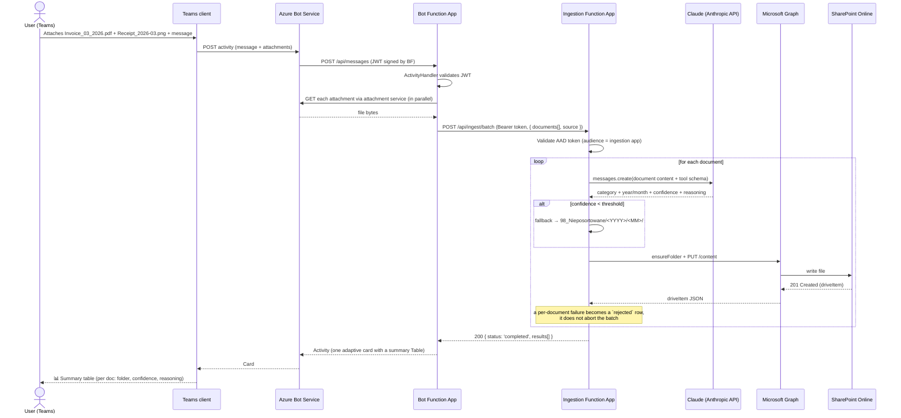

# Architecture

## 1. Goals & non-goals

**Goals**

- Conversational document-ingestion experience in Microsoft Teams.
- Content-based folder routing in SharePoint Online: each document is
  classified by **Claude** (Anthropic API), with a deterministic fallback to
  a manual-review folder when confidence is low.
- Fully managed, serverless Azure footprint — no VMs, no Kubernetes.
- Strict separation of concerns: the **bot** never touches SharePoint or
  the classifier directly; it only forwards work to an authenticated
  internal API.
- Zero secrets in source. Everything is in Key Vault and referenced through
  Function App settings.

**Non-goals**

- Building a generic chatbot framework. This agent has exactly one skill:
  *“take this file and file it”*.
- Long-running workflows. If an upload takes > ~30s the bot will respond
  with a *“still working”* message and move the work to a queue (future).

---

## 2. Component overview

| Component | Tech | Hosting |
|---|---|---|
| Teams Bot | Bot Framework SDK v4 (JS) | Azure Functions (Node 22, HTTP trigger) |
| Document Ingestion API | TypeScript + Azure Functions v4 programming model | Azure Functions (Node 22, HTTP trigger) |
| Shared library | TypeScript | Published intra-repo via Yarn workspaces |
| Channel registration | Azure Bot Service | Microsoft.BotService |
| Secrets | Azure Key Vault | Microsoft.KeyVault |
| Document classification | Claude (Anthropic Messages API) | api.anthropic.com (external) |
| File store | SharePoint Online (Microsoft Graph) | Microsoft 365 tenant |
| Telemetry | Application Insights | Microsoft.Insights |
| Infrastructure as code | Bicep | `infrastructure/` |

---

## 3. Sequence — happy path



> **Single-document route.** The original one-file-at-a-time endpoint
> `POST /api/ingest` (returning `{ status: 'uploaded', result }`) is retained
> for backwards compatibility and programmatic callers. The Teams bot always
> uses the batch route so the user gets one consolidated response.


---

## 4. Classification pipeline

The ingestion function pipes every file through an ordered list of
`Classifier` strategies. The first one that returns a `match` wins; the
fallback always succeeds last.

1. **`ClaudeClassifier`** — see
   [`packages/document-ingestion/src/services/claudeClassifier.ts`](./packages/document-ingestion/src/services/claudeClassifier.ts).  
   Sends the document **content** (PDF → `document` block, images → `image`
   block, text → `text` block) to the Anthropic Messages API together with a
   forced tool whose `input_schema` is generated from the folder taxonomy
   ([`folderTaxonomy.ts`](./packages/shared/src/parsers/folderTaxonomy.ts)).
   The model returns a `category`, optional `year`/`month`, and a `confidence`
   score. The category maps to a literal SharePoint path via `buildFolderPath`;
   `dated` categories get a nested `YYYY/MM` leaf. Invoice direction
   (sales vs. purchase) is resolved by injecting the client's identity
   (`CLIENT_COMPANY_NAME` + `CLIENT_NIP`) into the system prompt. The
   classifier **never throws** — unsupported content type, oversized files
   (`ANTHROPIC_MAX_CONTENT_BYTES`), confidence below
   `ANTHROPIC_CONFIDENCE_THRESHOLD`, unknown categories, and API errors all
   return `null` so the fallback runs. Disabled when `ANTHROPIC_ENABLED=false`
   or no API key is configured.
2. **`FallbackClassifier`** — `98_Nieposortowane/<YYYY>/<MM>/`. Always
   succeeds so the user never sees a *“nowhere to put this”* error; the file
   is routed to manual review.

Adding or changing a category means editing the single `categoryCatalog` in
[`folderTaxonomy.ts`](./packages/shared/src/parsers/folderTaxonomy.ts) plus a
unit test — the Claude prompt/tool schema and the fallback both derive from it.

### 4.1 Batch ingestion

When a Teams message carries **more than one** attachment, the bot does **not**
file them one-by-one. Instead
[`LedgerBot.handleMessage`](./packages/teams-bot/src/bot/ledgerBot.ts)
downloads every attachment (in parallel) and forwards the whole set in a single
call to `POST /api/ingest/batch`
([`handleIngestBatch`](./packages/document-ingestion/src/functions/ingestDocument.ts)).

- **Request:** `{ documents: IngestionDocument[], source }` — one shared
  `source` block for the whole activity. Validated by
  `validateBatchIngestionPayload` (max **25** documents, aggregate decoded
  size ≤ **100 MiB**).
- **Processing:** the ingestion function classifies and uploads each document
  through the exact same pipeline as the single-file route. A failure on one
  document (download error, oversized file, Graph/SharePoint error, …) is
  captured as a `rejected` item **without aborting the batch** — every other
  document is still filed.
- **Response:** `{ status: 'completed', results: IngestionBatchItemResult[] }`,
  where each item is either `uploaded` (with the drive item, folder path, and
  the classifier's Polish `reasoning`) or `rejected` (with an error message).
- **Presentation:** the bot renders **one** adaptive card containing a single
  `Table` (`buildBatchResultCard` in
  [`responseBuilder.ts`](./packages/teams-bot/src/bot/responseBuilder.ts)) with
  a row per document — **Dokument · Folder · Pewność · Uzasadnienie** — plus an
  `Action.OpenUrl` for each successfully uploaded file. This is the *“one table
  that explains why each document was classified where”* deliverable.

The relevant shared contracts live in
[`packages/shared/src/types/bot.ts`](./packages/shared/src/types/bot.ts):
`IngestionSource`, `IngestionDocument`, `IngestionUploadResult`,
`IngestionBatchRequestPayload`, `IngestionBatchItemResult`, and
`IngestionBatchResponsePayload`.

### 4.2 Multi-tenant client routing (planned, not yet implemented)

Today the ingestion function is wired at cold start to exactly **one**
`SharePointTarget` (one client's SharePoint site/drive) plus a static
`CLIENT_COMPANY_NAME`/`CLIENT_NIP` pair used only to disambiguate invoice
direction. The following design lets a **single deployment** route
documents to **many** clients' SharePoint spaces:

- **Client Directory** — a SharePoint list on the **BCR Group** site is
  the single source of truth. One row per client:
  `ClientId`, `NIP`, `CompanyNameAliases` (one alias per line),
  `PersonNames` (one name per line), `TeamsChannelId`, `SiteHostname`,
  `SitePath`, `DriveName`, `RootFolder`, `Status`. See
  [`docs/client-directory-admin-guide.md`](./docs/client-directory-admin-guide.md)
  for how to create and manage it.
- **Channel-authoritative routing (non-admin uploads).** Each client has
  their own dedicated Teams channel (Teams/AAD membership already
  restricts non-admin users to only their own channel). The upload's
  `source.conversationId` (already part of `IngestionSource`, populated
  from `activity.conversation?.id` in `LedgerBot`) is looked up directly
  against `TeamsChannelId` in the Client Directory — that row's site/drive
  **is** the destination. No document content is consulted to make this
  decision. **Do not confuse this with the Bot Framework `channelId`
  field** (`activity.channelId`), which is always the literal platform
  string `"msteams"` and carries no per-client information.
- **Content-based routing (admin uploads only).** Uploaders whose
  `source.userAadObjectId` is a registered admin are exempt from the
  channel lookup — admins have access to every channel, so their upload's
  destination is instead resolved from `ClaudeClassifier`'s extracted
  NIP/company-name/person-name against the same Directory rows (exact,
  normalized match only — no fuzzy matching, to avoid mis-filing into the
  wrong client). No match → falls back to `BCR Group` → `Shared`, using
  the same `buildFolderPath()` taxonomy.
- **Invoice direction** becomes derived rather than static: compare the
  *resolved* client's own `NIP` (from their Directory row) against the
  extracted seller/buyer NIP on the invoice, instead of a fixed
  `CLIENT_NIP` env var.
- **No cross-check between channel and content** is performed for
  non-admin uploads (a deliberate simplification — see repo history for
  the reasoning): the channel is trusted as-is.

---

## 5. Auth model

### 5.1 Teams → Bot

Standard Bot Framework JWT. The SDK middleware in
`@bcr/teams-bot` validates it using `MicrosoftAppCredentials` configured
with the Bot’s `MicrosoftAppId`, `MicrosoftAppPassword` (or, preferred,
a managed-identity federated credential), and `MicrosoftAppTenantId`.

### 5.2 Bot → Ingestion API

Client credentials via MSAL Node:

```
POST https://login.microsoftonline.com/<tenant>/oauth2/v2.0/token
  client_id     = <bot-app-id>
  client_secret = <bot-secret>            (Key Vault)
  scope         = api://<ingestion-app-id>/.default
  grant_type    = client_credentials
```

The ingestion function validates the JWT using `jose` and checks:
- `iss` matches the expected tenant authority
- `aud` matches its own App ID URI
- `roles` contains `Documents.Ingest`

### 5.3 Ingestion → Microsoft Graph

The Function App uses its **system-assigned managed identity**. A
federated credential on the Graph App Registration trusts the managed
identity, so we never store a Graph client secret.

Required Graph permissions (application):
- `Sites.Selected` — granted only on the target SharePoint site via
  `POST /sites/{id}/permissions` during deployment.
- `Files.ReadWrite.All` — only if you cannot use `Sites.Selected`.

---

## 6. Failure handling

| Failure | Behaviour |
|---|---|
| Claude is off, low confidence, or API error | Upload to `98_Nieposortowane/<YYYY>/<MM>/` for manual review. |
| SharePoint 409 (file exists) | Append `_n` suffix and retry once; report the final filename. |
| Graph 5xx | Exponential back-off with jitter via `p-retry` (max 3 attempts), then surface error card. |
| Token expired | MSAL token cache auto-refreshes; ingestion uses `getToken` lazily per request. |
| File > 4 MB | Switch to Graph **upload session** (`createUploadSession`) and chunk at 320 KiB × N. |
| Antivirus block (Graph 423) | Surface explicit message; do not retry. |

Every error is logged with the Teams `activityId` and `conversationId`
as custom dimensions on the Application Insights `requests` table,
so triage is one Kusto query away:

```kusto
requests
| where customDimensions["activityId"] == "<id>"
| project timestamp, name, resultCode, customDimensions
```

---

## 7. Deployment topology

A single Azure resource group per environment:

```
rg-bcr-ledger-<env>
├── stbcrledger<env>          (Storage – Functions runtime + uploads queue)
├── plan-bcr-ledger-<env>     (Linux consumption plan, Node 22)
├── func-bcr-bot-<env>
├── func-bcr-ingest-<env>
├── bot-bcr-ledger-<env>      (Azure Bot, Teams channel enabled)
├── kv-bcr-ledger-<env>       (Key Vault, RBAC mode)
├── ai-bcr-ledger-<env>       (Document Intelligence – S0)
├── appi-bcr-ledger-<env>     (Application Insights)
└── log-bcr-ledger-<env>      (Log Analytics workspace)
```

All wired up declaratively in [`infrastructure/main.bicep`](./infrastructure/main.bicep).
