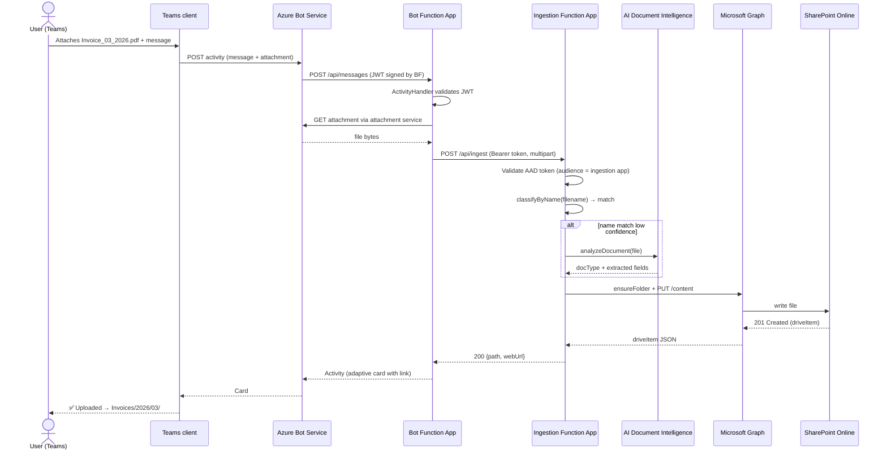

# Architecture

## 1. Goals & non-goals

**Goals**

- Conversational document-ingestion experience in Microsoft Teams.
- Deterministic folder routing in SharePoint Online based on file name
  (regex first) with content-based fallback (Azure AI Document Intelligence).
- Fully managed, serverless Azure footprint — no VMs, no Kubernetes.
- Strict separation of concerns: the **bot** never touches SharePoint or
  Document Intelligence directly; it only forwards work to an authenticated
  internal API.
- Zero secrets in source. Everything is in Key Vault and referenced through
  Function App settings.

**Non-goals**

- Building a generic chatbot framework. This agent has exactly one skill:
  *“take this file and file it”*.
- Long-running workflows. If an upload takes > ~30s the bot will respond
  with a *“still working”* message and move the work to a queue (future).

---

## 2. Component overview

| Component | Tech | Hosting |
|---|---|---|
| Teams Bot | Bot Framework SDK v4 (JS) | Azure Functions (Node 22, HTTP trigger) |
| Document Ingestion API | TypeScript + Azure Functions v4 programming model | Azure Functions (Node 22, HTTP trigger) |
| Shared library | TypeScript | Published intra-repo via Yarn workspaces |
| Channel registration | Azure Bot Service | Microsoft.BotService |
| Secrets | Azure Key Vault | Microsoft.KeyVault |
| Document classification (optional) | Azure AI Document Intelligence | Microsoft.CognitiveServices |
| File store | SharePoint Online (Microsoft Graph) | Microsoft 365 tenant |
| Telemetry | Application Insights | Microsoft.Insights |
| Infrastructure as code | Bicep | `infrastructure/` |

---

## 3. Sequence — happy path



---

## 4. Classification pipeline

The ingestion function pipes every file through an ordered list of
`Classifier` strategies. The first one that returns a `match` with
`confidence >= 0.8` wins.

1. **`FilenameRegexClassifier`** — see
   [`packages/shared/src/parsers/filenameParser.ts`](./packages/shared/src/parsers/filenameParser.ts).  
   Built-in patterns:
   - `Invoice_<MM>_<YYYY>` → `Documents/Invoices/<YYYY>/<MM>/`
   - `Contract_<COUNTERPARTY>_<YYYY>` → `Documents/Contracts/<YYYY>/<COUNTERPARTY>/`
   - `Receipt_<YYYY>-<MM>-<DD>` → `Documents/Receipts/<YYYY>/<MM>/`
   - `Statement_<ACCOUNT>_<YYYY>_<MM>` → `Documents/Statements/<ACCOUNT>/<YYYY>/<MM>/`
2. **`DocumentIntelligenceClassifier`** — calls Azure AI Document
   Intelligence (`prebuilt-invoice`, `prebuilt-receipt`, custom models).
   Reads `InvoiceDate`, `VendorName`, etc. and re-computes the target path.
3. **`FallbackClassifier`** — `Documents/Unsorted/<YYYY>/<MM>/`. Always
   succeeds so the user never sees a *“nowhere to put this”* error;
   instead they get a card asking them to confirm or move the file.

Adding a new pattern means editing one regex map plus a unit test. No
deployment-time configuration changes are required.

---

## 5. Auth model

### 5.1 Teams → Bot

Standard Bot Framework JWT. The SDK middleware in
`@bcr/teams-bot` validates it using `MicrosoftAppCredentials` configured
with the Bot’s `MicrosoftAppId`, `MicrosoftAppPassword` (or, preferred,
a managed-identity federated credential), and `MicrosoftAppTenantId`.

### 5.2 Bot → Ingestion API

Client credentials via MSAL Node:

```
POST https://login.microsoftonline.com/<tenant>/oauth2/v2.0/token
  client_id     = <bot-app-id>
  client_secret = <bot-secret>            (Key Vault)
  scope         = api://<ingestion-app-id>/.default
  grant_type    = client_credentials
```

The ingestion function validates the JWT using `jose` and checks:
- `iss` matches the expected tenant authority
- `aud` matches its own App ID URI
- `roles` contains `Documents.Ingest`

### 5.3 Ingestion → Microsoft Graph

The Function App uses its **system-assigned managed identity**. A
federated credential on the Graph App Registration trusts the managed
identity, so we never store a Graph client secret.

Required Graph permissions (application):
- `Sites.Selected` — granted only on the target SharePoint site via
  `POST /sites/{id}/permissions` during deployment.
- `Files.ReadWrite.All` — only if you cannot use `Sites.Selected`.

---

## 6. Failure handling

| Failure | Behaviour |
|---|---|
| Filename doesn’t match any pattern and AI is off | Upload to `Unsorted/<YYYY>/<MM>/`, return an adaptive card with a *“choose a folder”* picker. |
| SharePoint 409 (file exists) | Append `_n` suffix and retry once; report the final filename. |
| Graph 5xx | Exponential back-off with jitter via `p-retry` (max 3 attempts), then surface error card. |
| Token expired | MSAL token cache auto-refreshes; ingestion uses `getToken` lazily per request. |
| File > 4 MB | Switch to Graph **upload session** (`createUploadSession`) and chunk at 320 KiB × N. |
| Antivirus block (Graph 423) | Surface explicit message; do not retry. |

Every error is logged with the Teams `activityId` and `conversationId`
as custom dimensions on the Application Insights `requests` table,
so triage is one Kusto query away:

```kusto
requests
| where customDimensions["activityId"] == "<id>"
| project timestamp, name, resultCode, customDimensions
```

---

## 7. Deployment topology

A single Azure resource group per environment:

```
rg-bcr-ledger-<env>
├── stbcrledger<env>          (Storage – Functions runtime + uploads queue)
├── plan-bcr-ledger-<env>     (Linux consumption plan, Node 22)
├── func-bcr-bot-<env>
├── func-bcr-ingest-<env>
├── bot-bcr-ledger-<env>      (Azure Bot, Teams channel enabled)
├── kv-bcr-ledger-<env>       (Key Vault, RBAC mode)
├── ai-bcr-ledger-<env>       (Document Intelligence – S0)
├── appi-bcr-ledger-<env>     (Application Insights)
└── log-bcr-ledger-<env>      (Log Analytics workspace)
```

All wired up declaratively in [`infrastructure/main.bicep`](./infrastructure/main.bicep).
