# P0: Phase-0 routing

**Status: PHASE-0.** This is how an upload is routed once the Phase-0 containment is deployed on
today's code, with no database. It is interim: the TARGET design in
[D2](02-target-business-logic.md) and [D5](05-sequence-upload.md) replaces it.

What changes compared with [D1](01-as-is.md):
- Content never changes the client. Promotion by a NIP found in the document is deleted.
- An upload that cannot be tied to exactly one client goes to a staff-only quarantine site, not
  to the BCR GROUP library.
- Every write goes into the client's channel folder, because the Directory row's `RootFolder` is
  set to it. A row without `RootFolder`, `DriveId` or `TeamId` routes nobody.
- A bound uploader routes only while their Teams, read from Entra at upload time, are exactly
  the row's `TeamId` (R46). A guest later added to another client's Team is quarantined.

Colours and conventions are in the [README](README.md).

```mermaid
flowchart TB
  classDef client fill:#dbeafe,stroke:#2563eb,color:#0b2e6b
  classDef agent fill:#e0e7ff,stroke:#4f46e5,color:#221a63
  classDef staff fill:#dcfce7,stroke:#16a34a,color:#0d3b1e
  classDef system fill:#f1f5f9,stroke:#64748b,color:#1e293b
  classDef external fill:#fef3c7,stroke:#d97706,color:#5a3608
  classDef gate fill:#fee2e2,stroke:#dc2626,color:#6b1414

  U["Client guest sends files<br/>in the 1:1 DM with the bot"]:::client
  subgraph BOTAPP["teams-bot app"]
    GATE{"Bot gate on every activity:<br/>personal conversation, BCR tenant,<br/>GUID aadObjectId?"}:::gate
    GREJ["One fixed Polish line<br/>no download"]:::gate
    DL["Download attachments in parallel<br/>one POST /api/ingest/batch<br/>app-only AAD JWT"]:::system
  end
  subgraph INGAPP["document-ingestion app"]
    AUTH{"Caller pinned? signature, audience,<br/>role, appid or azp in<br/>BOT_CALLER_APP_IDS"}:::gate
    SRC{"Strict source? conversationType personal,<br/>userAadObjectId is a UUID,<br/>tenantId is the BCR tenant"}:::gate
    REJ["Refused before any work<br/>401 or 403 caller, 400 source"]:::gate
    SNAP{"Directory snapshot younger than<br/>CLIENT_DIRECTORY_MAX_STALE_MS?"}:::gate
    PASS["Two-pass snapshot<br/>pass 1 collects every key per row,<br/>pass 2 admits clean keys and rows only"]:::system
    RULES["Pass 2 rules<br/>user-id conflict: drop only that key<br/>same site host + canonical path, same DriveId<br/>or same TeamId: exclude every row sharing it<br/>SitePath not exactly /sites or /teams + name,<br/>host not QUARANTINE_SITE_HOSTNAME,<br/>forbidden or quarantine site: exclude the row<br/>NIP or ClientId duplicate: alert only<br/>no alias or person-name maps"]:::system
    WHO{"Uploader AAD id on exactly<br/>one admitted client row?"}:::gate
    MEM{"Uploader's Teams, read from Entra now<br/>memberOf as the managed identity, 5 min cache,<br/>exactly the row's TeamId?"}:::gate
    BOUND["Bound client target from that row<br/>site, drive, RootFolder = channel folder<br/>RootFolder, DriveId and TeamId all set"]:::client
    CLS["Claude classifies, primed with the<br/>bound client only. Below the threshold<br/>or on failure: 98_Nieposortowane/YYYY/MM"]:::agent
    FLIP["After classification: invoice direction<br/>flip inside the same client only<br/>no promotion, parties never pick a client"]:::gate
    SITE{"Resolved site collection is<br/>BCR GROUP or the quarantine site?"}:::gate
    DRV{"Resolved drive equals the<br/>row's DriveId?"}:::gate
    UPC["PUT into the client folder<br/>conflictBehavior=fail, retry _1 to _10<br/>segments sanitised, then encoded<br/>own retry: network, 500, 502 only"]:::system
    WOK{"Written after retries?"}:::gate
    QR["Quarantine, with one reason<br/>the folder never depends on content"]:::gate
    UPQ["PUT Kwarantanna/YYYY/MM/{batchId}/<br/>sanitised original filename, conflictBehavior=fail<br/>then PATCH UploaderOid, QuarantineReason,<br/>OriginalFilename, DocumentId"]:::system
    QFAIL["Quarantine write failed<br/>rejected row, spróbuj ponownie<br/>error log document.quarantine_failed<br/>never written anywhere else"]:::gate
    LOG["Logs, ids only: document.filed with teamId,<br/>document.quarantined, directory.conflict,<br/>membership.mismatch, membership.unverified,<br/>document.quarantine_failed,<br/>sharepoint.forbidden_site,<br/>sharepoint.possible_duplicate"]:::system
  end
  ANT["Anthropic API"]:::external
  subgraph M365["Microsoft 365 tenant BCR"]
    subgraph BCRG["BCR GROUP site, Private"]
      CD[("Client Directory list<br/>ingestion reads it only")]:::system
      FORB["Team library: a forbidden target<br/>no ledger writes"]:::gate
    end
    subgraph QSITE["BCR Ledger - Kwarantanna site"]
      QS["Staff-only library<br/>no M365 group, sharing off"]:::gate
    end
    subgraph SX["Client X private Team site"]
      FX["Dokumenty księgowe channel folder<br/>visible in the Shared tab"]:::client
    end
  end
  subgraph CARD["One result card in the DM"]
    CU["Uploaded row: Dokument, Kategoria, Folder<br/>open link into the client's own space"]:::client
    CQ["Quarantined row: original filename and<br/>Dokument przekazano do weryfikacji<br/>przez zespół BCR. No link"]:::client
    CR["Rejected row: a generic Polish<br/>message chosen by error code"]:::client
  end

  U --> GATE
  GATE -->|"yes"| DL
  GATE -->|"no, BOT_GATE_MODE enforce"| GREJ
  GATE -.->|"no, log mode: log bot.gate.rejected, continue"| DL
  DL --> AUTH
  AUTH -->|"yes"| SRC
  AUTH -->|"no"| REJ
  SRC -->|"yes"| SNAP
  SRC -->|"no"| REJ
  SNAP -->|"yes"| PASS
  SNAP -->|"no: empty snapshot, stale_directory"| QR
  CD -.->|"list read"| PASS
  PASS -.- RULES
  PASS -.-|"a row pointing here is excluded"| FORB
  PASS --> WHO
  WHO -->|"yes"| MEM
  MEM -->|"yes"| BOUND
  MEM -->|"no: membership_mismatch"| QR
  MEM -->|"read failed: membership_unverified"| QR
  WHO -->|"no row: unmapped"| QR
  WHO -->|"IsAdmin row: staff"| QR
  WHO -->|"key dropped: conflict"| QR
  WHO -->|"row on a forbidden site: forbidden_target"| QR
  WHO -->|"row not bound: unbound_target"| QR
  BOUND --> CLS
  CLS -->|"bytes of client X only"| ANT
  CLS --> FLIP
  FLIP --> SITE
  SITE -->|"no"| DRV
  SITE -->|"yes: forbidden_target"| QR
  DRV -->|"yes"| UPC
  DRV -->|"no: stale_directory"| QR
  UPC --> WOK
  WOK -->|"yes"| FX
  WOK -->|"no: target_unwritable"| QR
  QR --> UPQ
  UPQ -->|"written"| QS
  UPQ -->|"failed"| QFAIL
  FX -->|"webUrl inside client X"| CU
  QS --> CQ
  QFAIL --> CR
  REJ --> CR
  UPC -.-> LOG
  UPQ -.-> LOG
  style SX fill:#ffffff,stroke:#dc2626,stroke-width:2px,stroke-dasharray: 6 4
  style QSITE fill:#ffffff,stroke:#dc2626,stroke-width:2px,stroke-dasharray: 6 4
  style BCRG fill:#ffffff,stroke:#dc2626,stroke-width:2px,stroke-dasharray: 6 4
```

## Quarantine reasons

Every quarantined upload records exactly one reason in the `QuarantineReason` column of the
quarantine library and in the `document.quarantined` log event.

| Reason | When |
|---|---|
| `unmapped` | The uploader's AAD object id is on no admitted Directory row. |
| `staff` | The id is on a row marked `IsAdmin`. Staff are never routed to a client by the bot in Phase 0; they file by hand in SharePoint. |
| `conflict` | Pass 2 dropped what would have matched: the id was on two rows, or the uploader's row shares its site (host + canonical path, whatever drive or folder), its `DriveId` or its `TeamId` with another active client row. |
| `stale_directory` | The snapshot is older than `CLIENT_DIRECTORY_MAX_STALE_MS`, so it counts as empty. Or the resolved drive is not the row's `DriveId`. |
| `forbidden_target` | The row's `SitePath` is in `FORBIDDEN_TARGET_SITE_PATHS` (BCR GROUP is always on the list, and the quarantine site is added automatically), is not exactly `/sites/<name>` or `/teams/<name>`, or its host is not `QUARANTINE_SITE_HOSTNAME`. Or, at upload time, the site Graph resolved is BCR GROUP or the quarantine site (`sharepoint.forbidden_site`). |
| `unbound_target` | The uploader's only row lacks `RootFolder`, `DriveId` or `TeamId`. Only `directory-bindings.mjs apply` binds a row, and it writes all three together. |
| `membership_mismatch` | The uploader's row is bound, but their Teams, read from Entra (`memberOf`) at upload time, are not exactly its `TeamId`: they are also in another Team, or no longer in this one. |
| `membership_unverified` | The uploader's Teams could not be read after retries (no `Directory.Read.All` in the ingestion identity's token, the user gone, Graph down). Never cached. |
| `target_unwritable` | The client target could not be written after retries. |

If the quarantine write itself fails, the user gets a rejected row asking them to try again, a
`document.quarantine_failed` error is logged, and the file is not written anywhere else. No alert
rule exists yet: alerting comes with the monitoring work in Phase 1. Until then an operator
watches for that event
([`human-steps.md` H-12](../operations/human-steps.md#h-12-the-change-window-ingestion-deploy-bindings-canaries),
the watch query and "After the window").

## Directory snapshot

- **Pass 1** reads every active row and records, for each key, the set of rows that carry it.
  The keys are the uploader AAD ids, the NIP, the ClientId, the site (host + canonical path), the
  `DriveId` and the `TeamId`. Two client rows on one site conflict whatever drive or folder each
  names.
- **Pass 2** admits rows and keys under the rules in the `RULES` node. The result does not depend
  on row order. A third duplicate cannot win, which was defect X6 in D1.
- A conflict is logged once per refresh as `directory.conflict{kind, listItemIds}`, without key
  values.
- The alias and person-name maps are deleted. Content never feeds routing.
- `RootFolder`, `DriveId` and `TeamId` are required for a row to route. `TeamId` is a conflict key
  and is logged; `DriveId` is a conflict key and is checked at upload time. The uploader's Team
  membership is checked twice: by the binding tool when it runs, and by ingestion at upload time
  against `TeamId` (the `MEM` node).

## Deploy order

The strict source check refuses anything an old bot sends, so the order matters:

1. Deploy the bot, which now sends `conversationType`, with `BOT_GATE_MODE=log`.
2. After 24 hours of clean `bot.gate.rejected` logs, set `BOT_GATE_MODE=enforce`.
3. Deploy ingestion with the strict source schema and caller pinning.

`tools/directory-bindings.mjs` then sets each client row's `RootFolder`, `UserAadObjectIds`,
`DriveId` and `TeamId` in the same change window, followed by one canary upload per client.

## Removed in Phase 0

- Content-based promotion, and the fallback bucket in the BCR GROUP library.
- The single-document route `/api/ingest` and `/api/user-target`. The Personal Tab leaves the
  manifest, and `/api/mydocs` becomes a static page with no client data.
- The alias and person-name lookups.
- The model's free-text reasoning and the confidence column in result cards.
- Probe GETs before upload: a name collision now shows up as a 409 from `conflictBehavior=fail`.
