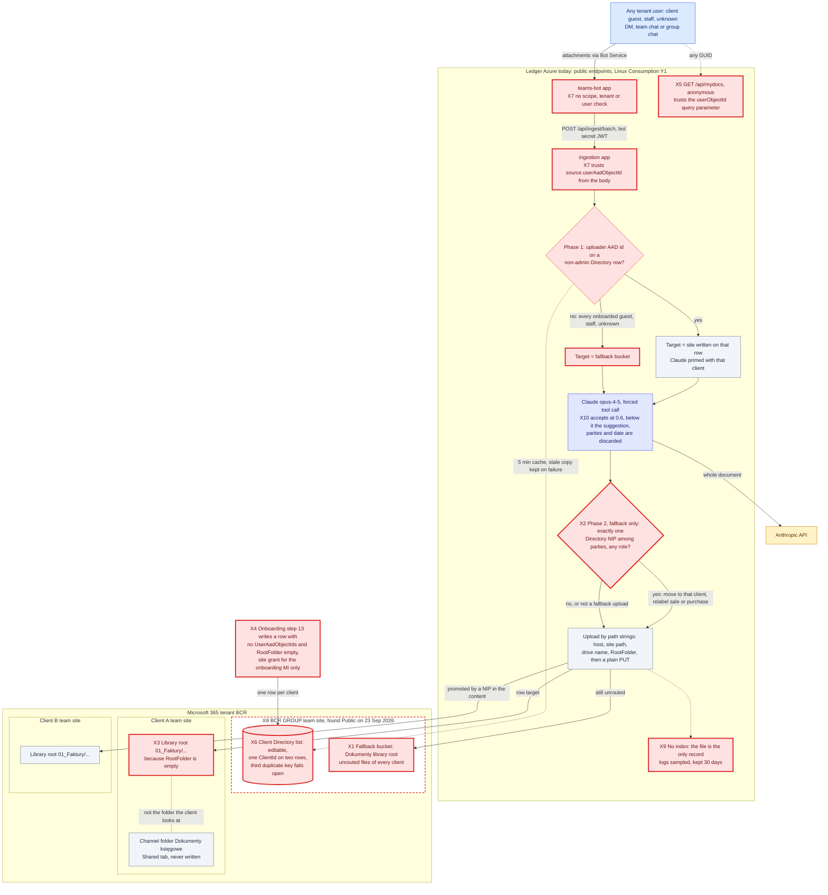

# D1: The flow before Phase 0

> **Private: dev team only until Phase 0 is deployed.** This diagram describes defects that can
> still be exploited on the live tenant. Do not share it in slides, email or tickets, and do not
> share screenshots of it.

**Status: AS-IS.** The code at `cbf1630` on 25 Sep 2026, before Phase 0, with the defects found by
the audit marked X1 to X10. It is frozen and is never updated. Commit `21b0883` already points the
old fallback at the quarantine settings. [00-phase0-routing.md](00-phase0-routing.md) shows the
flow after Phase 0.

Defects use the `defect` class, a red box with a thick border. Other colours follow the
[README](README.md#colour-key).

## Defect key

Paths are in this repo unless marked **O** (the onboarding repo). Line numbers are at `cbf1630`.

| Mark | Defect | Evidence | Removed by |
|---|---|---|---|
| X1 | Unrouted uploads land in a fallback bucket at the root of the BCR GROUP team library, which every member of that team can read | `packages/document-ingestion/src/runtime.ts:34-45` | P0-2: the staff-only quarantine site. IR-1 and IR-2 inventory and relocate what already landed there. |
| X2 | Content-based promotion: a fallback upload moves to whichever client's NIP appears in the document, in any role. A crafted PDF can plant files in any client's space. | `packages/document-ingestion/src/services/clientResolver.ts:146-224` | P0-1: promotion deleted, guarded by a source-scan test |
| X3 | Files land at the library root, not in the channel folder the client sees | O `provisioning/clientDirectory.ts:92-94` | Phase 0: `directory-bindings.mjs` sets `RootFolder`. Phase 2: storage by id, plus the root migration. |
| X4 | Onboarding never records the guest's AAD id and grants the site only to the onboarding identity, so every onboarded client's upload counts as unknown | O `provisioning/clientDirectory.ts:85-104` | Phase 0: `directory-bindings.mjs` binds guests. Phase 2: onboarding v2 writes the binding through the registry. |
| X5 | The anonymous Personal Tab maps any user id to that user's client (IDOR) | `packages/teams-bot/src/functions/mydocs.ts:30-68` | P0-5 |
| X6 | Directory integrity: one ClientId on two rows, and the duplicate check fails open from the third duplicate on | `packages/document-ingestion/src/services/clientDirectoryReader.ts:275-292` | P0-4: the two-pass snapshot. Phase 2 moves routing into the database. |
| X7 | The bot accepts any conversation type and any tenant. Ingestion trusts the user id sent in the request body. | `teams-app/manifest.json:28`, `packages/document-ingestion/src/functions/validation.ts:21-30` | P0-3 (bot gate and strict source), P0-8 (caller pinning). Phase 3 replaces the HTTP route with a queue. |
| X8 | The BCR GROUP team was Public at the 23 Sep audit | O `docs/operations/client-access.md` | Tenant change, already made: the team is Private, intentionally. Audit check A12 verifies it read-only. |
| X9 | No index and no audit trail: the file is the only record, and logs are kept 30 days | the whole pipeline | Phase 2: the document index |
| X10 | Effective threshold 0.6, and below it the suggestion, parties and date are thrown away | `packages/document-ingestion/src/services/claudeClassifier.ts:130-137` | Phase 1: one acceptance policy at 0.70 that keeps the suggestion |
