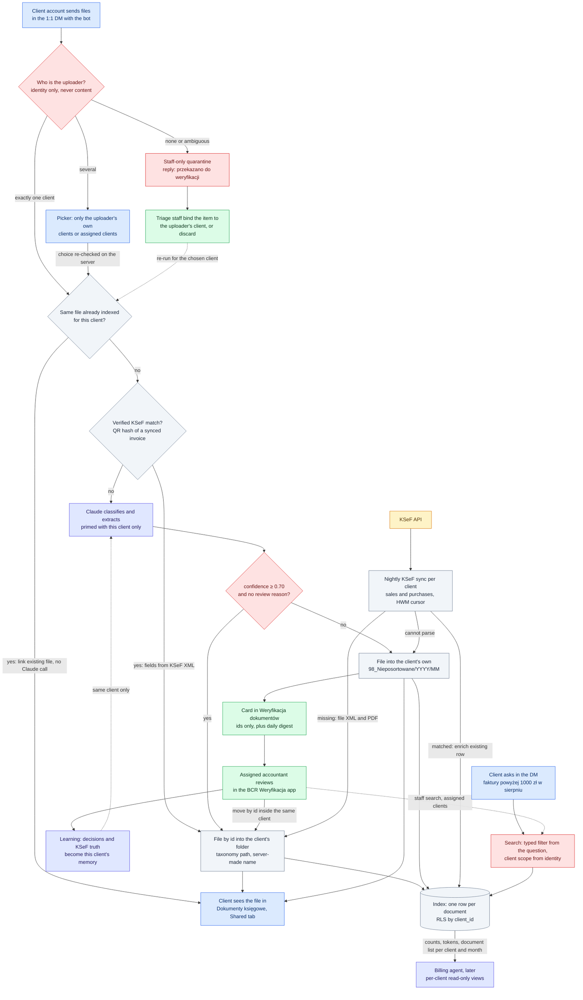

# D2: Target business logic

**Status: TARGET.** The reconciled v2 design, copied verbatim from the approved plan. None of it
is built yet. [00-phase0-routing.md](00-phase0-routing.md) shows what runs after Phase 0.

**Amended 29 September 2026.** The plan drew the client as a Teams guest. The owner's decision
of 28 September makes a client's identity its `{NIP}@bcr-group.pl` account, an Entra Member
created by BCR, and gives guests no capability in the ledger. The nodes that said "client guest"
now say "client account", and the reading notes marked "amended" say what that changes; the
rest is the plan as approved.

Colour shows who acts: client blue, agent indigo, staff green, system grey, external amber, gate
red. See the [README](README.md#colour-key).

## Reading notes

- **Routing uses identity only.** `BIND` looks at who uploaded, never at what the document says.
  If the content does not match the uploader's client, the document stays in that client and gets
  the review reason `CLIENT_NOT_PARTY` (invariants I2, I3). A guest is not a client and binds to
  nothing (amended 29 Sep 2026).
- **Picker.** A staff member with several assigned clients gets a picker. The plan also gave one
  to a guest in more than one client Team, where every membership is approved; a client account
  belongs to one company and is in one client Team only, so no client gets one any more (amended
  29 Sep 2026). The card carries only a `pendingId`, and the
  server re-checks the choice against the uploader's current bindings. See
  [D5](05-sequence-upload.md).
- **Quarantine.** An uploader who cannot be tied to exactly one client goes to the staff-only
  quarantine. The reply carries no link and no client name. Triage staff can bind an item only to
  one of the uploader's own clients or assignments, or else with two approvals. A bind creates a
  new document row in that client and runs the normal pipeline for it. A guest's upload never
  gets there: it is refused with nothing stored, as the next Phase-0 ingestion build does
  (amended 29 Sep 2026).
- **Dedupe** is per client. A lookup across all clients would reveal whether another client holds
  the same file.
- **KSeF match.** `KM` accepts only a verified match: the QR hash of an invoice already synced
  for this client, or a KSeF number from the PDF text layer whose invoice also agrees on seller
  NIP, gross amount and issue date. A filename is never a key.
- **Below 0.70**, or with any review reason, the file goes to the client's own
  `98_Nieposortowane/YYYY/MM` and gets a review task. The model's suggestion is kept in the index.
- **Review** moves a file by id, inside the same client's drive. The move itself is done by
  ingestion, the only SharePoint writer (see [D6](06-sequence-review.md)).
- **Learning** reads only the same client's memory (I11).
- **Decisions pending with Roman:** whether clients see `NEEDS_REVIEW` items in search (default:
  visible, labelled "w weryfikacji"), and the review SLA values.
