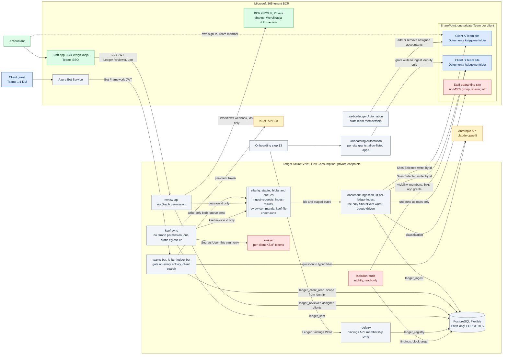

# D3: Target architecture and identities

**Status: TARGET.** The reconciled v2 design, copied verbatim from the approved plan. None of it
is built yet.

Each edge names the identity or role it uses. Colours follow the
[README](README.md#colour-key).

## Reading notes

- **One SharePoint writer.** Only `document-ingestion`, running as `id-bcr-ledger-ingest`, writes
  to SharePoint: client folders by id, the quarantine site, KSeF filings and review moves (I1).
  `review-api` and `ksef-sync` hold no Graph permission. They put ids on the `review-commands` and
  `ksef-file-commands` queues, and ingestion does the work.
- **Ingestion is queue-driven.** After the cutover it exposes no HTTP route except `/api/health`.
  The bot writes the uploaded bytes to staging blobs it cannot read back, and sends the request on
  `ingest-requests`. The result comes back on `ingest-results` (I6).
- **Database roles.** Every caller has its own role (`ledger_ingest`, `ledger_client_read`,
  `ledger_reviewer`, `ledger_ksef`, `ledger_registry`). None of them owns tables or bypasses
  row-level security (I4).
- **Site grants.** The onboarding Automation account grants site write to the ingestion identity
  only. The ledger's own Automation account adds and removes assigned accountants as Team members.
- **KSeF credentials** live in `kv-ksef`, which only `ksef-sync` can read.
- **Isolation audit** runs nightly, read-only, and can block a target (I12).
- **Pending:** the onboarding-to-registry binding edge needs Roman to re-rule Q21.
