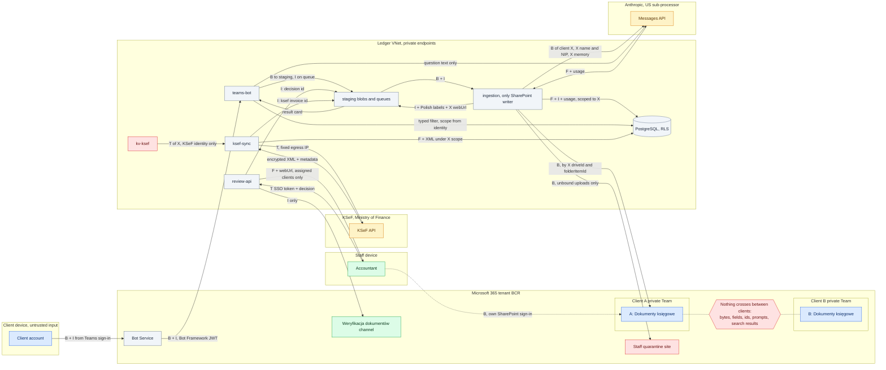

# D4: Target data flow and trust boundaries

**Status: TARGET.** The reconciled v2 design, copied verbatim from the approved plan. None of it
is built yet.

**Amended 29 September 2026.** The client node said "client guest". Since the owner's decision
of 28 September a client's identity is its `{NIP}@bcr-group.pl` account, an Entra Member created
by BCR; guests have no capability in the ledger. The rest is the plan as approved.

Each subgraph is a trust boundary. Each edge label says what crosses it:

| Letter | Meaning |
|---|---|
| B | Document bytes |
| F | Extracted fields |
| T | A token or secret |
| I | Ids only |

## Reading notes

- **Nothing crosses between clients.** No bytes, fields, ids, prompts or search results pass
  from one client's Team to another's. The `NEVER` node stands for that rule.
- **Anthropic** receives the bytes of one client X, with X's name, NIP and memory. The cached
  prompt prefix contains no client data, so it is byte-identical across clients (I11).
- **Staff** open files with their own SharePoint sign-in. The review app returns fields and a
  link, never the bytes.
- **Queues and the staff channel** carry ids only (I7).
- **KSeF**: the token of client X is read only by the KSeF identity. The KSeF job stores
  fields and XML under X's scope and puts only an invoice id on the queue. Ingestion then files the
  PDF and XML (see [D7](07-sequence-ksef.md)).
