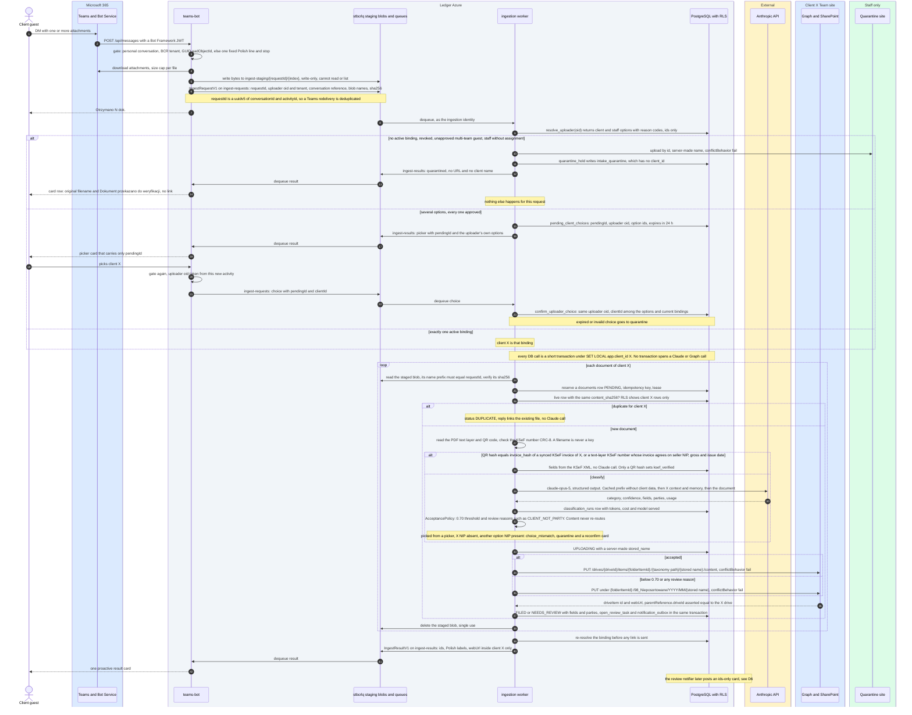

# D5: Client upload through the bot DM

**Status: TARGET.** The upload path after the Phase-3 queue cutover, with the index database from
Phase 2. None of it is built yet. [00-phase0-routing.md](00-phase0-routing.md) shows what runs
after Phase 0.

Boxes mark whose side a participant is on: blue for Microsoft 365 and the client, grey for the
ledger's own apps, amber for external services, green for staff only. See the
[README](README.md#trust-boundaries).

## Reading notes

- **The bot cannot inject or read an upload.** Its identity can write staging blobs and send on
  `ingest-requests`, and nothing else: it cannot read blobs back, it holds no ingestion role, and
  it has no database write (I6). Ingestion accepts a blob only under the message's own
  `ingest-staging/{requestId}/` prefix, and each blob is used once and then deleted.
- **The picker card carries only a `pendingId`.** The uploader's oid on the choice comes from the
  new activity, never from the card. Ingestion accepts the choice only for the same uploader, and
  only for a client that is still among the options and the uploader's current bindings. An
  expired or invalid choice goes to quarantine.
- **Content never re-routes (I2).** A document whose parties do not include client X gets the
  review reason `CLIENT_NOT_PARTY` inside client X. The only case where content matters is a
  picker choice that contradicts the document (`choice_mismatch`). Even then the file goes to
  quarantine, never to the other client.
- **The KSeF match never uses a filename.** It accepts the QR `invoiceHash`, which alone sets
  `ksef_verified`, or a KSeF number from the PDF text layer that passes the CRC-8 check, but only
  when the invoice also agrees on seller NIP, gross amount and issue date. The business-key match
  (seller NIP, invoice number, gross and date, accepted only when exactly one document matches)
  runs on the KSeF side (see [D7](07-sequence-ksef.md)).
- **Uploads never overwrite (I8).** Names are generated on the server, and the URL is built only
  from the bound client's `driveId` and `folderItemId`.
- **The result card** carries ids, fixed Polish labels and links inside client X only. It
  carries no model text (I7).
