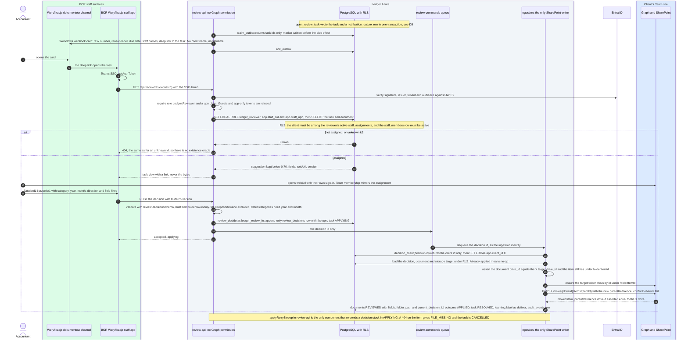

# D6: Manual review

**Status: TARGET.** Review in the staff app "BCR Weryfikacja", with notifications in the
"Weryfikacja dokumentów" channel. None of it is built yet.

The review app holds **no SharePoint permission**. It records the decision and puts the decision
id on the `review-commands` queue. Ingestion, the only SharePoint writer, moves the file by id
inside the same client's drive. Boxes follow the [README](README.md#trust-boundaries).

## Reading notes

- **Ids only.** The channel card and the queue message carry ids and codes. They carry no client
  name, filename or NIP (I7).
- **Scope comes from the token.** The reviewer's oid and upn come from the verified SSO token and
  are set per transaction. Row-level security then shows only clients the reviewer is actively
  assigned to. An unassigned or unknown task gives the same 404.
- **The move stays inside one drive.** Ingestion takes the client from the decision, not from any
  message field, and checks that the file and the target folder are in that client's drive and
  under its channel folder before it sends the PATCH. Moving by item id also survives the client
  renaming the file while it waits in `98_Nieposortowane`.
- **Odrzuć** (reject) and **To duplikat** (duplicate) move nothing. The document becomes
  `REJECTED` or `DUPLICATE` and the file stays where it is.
- **Quarantine bind** is visible only to triage staff. A bind makes ingestion create a new document
  row in the chosen client and run the normal pipeline for it. The quarantine row has no
  `client_id` to change.
- **Learning.** The decision becomes a label for the same client only. The next classification for
  client X reads only client X's memory (I11).
