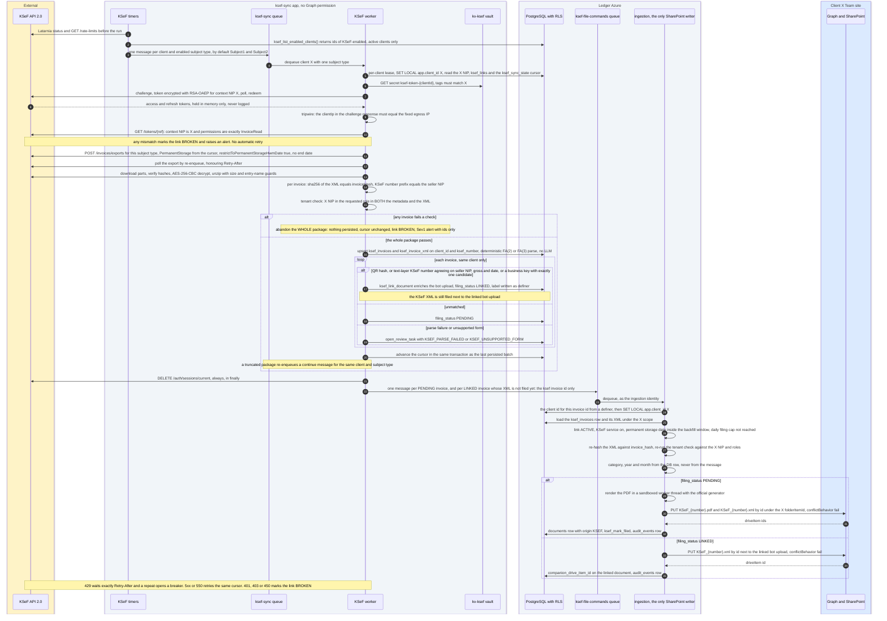

# D7: Nightly KSeF sync for one client

**Status: TARGET.** The KSeF sync from Phase 4. None of it is built yet.

The KSeF job has **no Graph permission**. It stores invoices under the client's scope and puts
only a KSeF invoice id on the `ksef-file-commands` queue. Ingestion, the only SharePoint writer,
loads the XML under the client's scope, checks it again, renders the PDF and files both. Boxes
follow the [README](README.md#trust-boundaries).

## Reading notes

- **Separate identities.** `ksef-sync` reads KSeF tokens from `kv-ksef` and can reach KSeF, but
  it cannot touch SharePoint. Ingestion can write SharePoint but cannot read `kv-ksef`. A
  compromise of one side does not give the other side's capability.
- **Tenant mismatch abandons the whole package.** If any invoice in an export package fails the
  tenant check, nothing from that package is persisted, the cursor does not move, the link is
  marked `BROKEN` and a Sev1 alert fires. No invoice is dropped silently while the rest are kept.
- **Ingestion checks everything again.** The queue message carries only the invoice id, and never
  any PDF bytes. Ingestion finds the client through a definer, loads the XML under that client's
  scope, re-hashes it, re-runs the tenant check, and derives the folder from the database row. It
  also requires an active KSeF link, the KSeF service on the client, a permanent-storage date
  inside the link's backfill window, and a per-client daily filing cap. It renders the PDF itself.
  The name of the definer that maps an invoice id to its client is not fixed yet; it plays the
  same role as `decision_client` does for review decisions.
- **A linked invoice still gets its XML.** When a bot upload matched, ingestion files only
  `KSeF_{number}.xml` next to it and records it as the document's companion file.
- **Matching stays inside one client (I11).** The same invoice between two BCR clients becomes two
  rows, one for each client, keyed on `(client_id, ksef_number)`. Only the QR hash sets
  `ksef_verified`. A business-key match is accepted only when exactly one document matches.
- **The cursor moves only after the data is persisted.** Filing to SharePoint happens afterwards,
  so a SharePoint failure never blocks the cursor. If filing gets a 409, ingestion compares
  hashes: the same file is `ALREADY_FILED`, a different file opens a `KSEF_FILE_CONFLICT` review
  task.
- **Zero LLM tokens** on this path. The XML is parsed deterministically.
