# D8: Index database, canonical tables

**Status: TARGET.** The canonical tables of the ledger database (PostgreSQL Flexible Server 17)
from Phases 1 to 5. None of them exist yet. Once the migrations exist they are the source of
truth, and in Phase 1 a CI check compares this diagram with them.

Tables are in schema `ledger` unless the name says otherwise. Only the columns that matter for
isolation and routing are shown.

```mermaid
erDiagram
  clients ||--o| client_storage_targets : "one storage target"
  clients ||--o{ client_users : "bound guests"
  clients ||--o{ staff_assignments : "assigned accountants"
  staff_members ||--o{ staff_assignments : "holds"
  clients ||--o{ documents : "owns"
  client_storage_targets ||--o{ documents : "drive, composite FK"
  documents ||--o{ document_parties : "parties, data only"
  documents ||--o{ classification_runs : "model calls"
  documents |o--o{ review_tasks : "DOCUMENT subject"
  ksef_invoices |o--o{ review_tasks : "KSEF_INVOICE subject"
  review_tasks ||--o{ review_decisions : "append-only"
  review_tasks }o--o{ notification_outbox : "task ids only"
  intake_quarantine |o--o| documents : "BIND creates a new row"
  clients ||--o{ ksef_sync_state : "cursor per subject type"
  clients ||--o{ ksef_invoices : "from KSeF"
  ksef_invoices |o--o| documents : "linked or filed"
  documents ||--o{ label : "trusted labels"
  review_decisions |o--o| label : "captured as definer"
  clients ||--o{ counterparty_stats : "per-client memory"
  clients |o--o{ audit_events : "hash chain per client"

  clients {
    uuid client_id PK "tenant key"
    text client_no UK "four digits, display only"
    text nip UK "attribute, not the key"
    text legal_name
    text status "PROVISIONING, ACTIVE, SUSPENDED, OFFBOARDED"
    text[] services "accounting, payroll, ksef"
    boolean is_test
    date purge_after
    boolean legal_hold
  }
  client_storage_targets {
    uuid client_id PK, FK "NOT NULL"
    uuid team_group_id UK "private Team"
    text site_id UK
    text channel_id UK "standard channel Dokumenty księgowe"
    text drive_id UK
    text folder_item_id "channel filesFolder, unique with drive_id"
    text status "PENDING_VERIFICATION, ACTIVE, BLOCKED"
    timestamptz attested_at "visibility attested"
  }
  client_users {
    uuid client_id PK, FK "NOT NULL"
    uuid user_oid PK "Guests only, never staff"
    text source "ONBOARDING, TEAM_SYNC, IMPORT"
    text status "ACTIVE, PENDING_APPROVAL, REVOKED"
    timestamptz last_seen_in_team_at "must be fresher than 1 h"
  }
  staff_members {
    uuid staff_oid PK "never a client user"
    text upn UK
    boolean active
    boolean is_admin
    boolean can_triage_quarantine
  }
  staff_assignments {
    uuid assignment_id PK
    uuid client_id FK "NOT NULL"
    uuid staff_oid FK
    text kind "PRIMARY, BACKUP"
    boolean active
    text team_membership_state "PENDING, MEMBER, FAILED, SKIPPED_OWNER"
  }
  documents {
    uuid document_id PK
    uuid client_id FK "NOT NULL, immutable, RLS key"
    text origin "BOT, KSEF, STAFF, QUARANTINE_RELEASE, SP_DIRECT, BACKFILL"
    text status "PENDING, CLASSIFYING, UPLOADING, FILED, NEEDS_REVIEW, REVIEWED, REJECTED, DUPLICATE, UPLOAD_FAILED, ABANDONED"
    text idempotency_key "unique with client_id"
    bytea content_sha256 "live rows unique per client only"
    text content_qxh "quickXorHash, checked before adopting a 409"
    text drive_id FK "composite FK with client_id"
    text drive_item_id UK
    text stored_name "made by the server"
    text original_filename
    text category "the real folder category"
    jsonb suggestion "kept at any confidence"
    numeric raw_confidence
    numeric calibrated_confidence
    text[] review_reasons
    text ksef_number "CRC-checked, unique per client"
    uuid ksef_invoice_id FK
    boolean ksef_verified "set by QR hash only"
    date retention_until
  }
  document_parties {
    uuid client_id PK, FK "NOT NULL"
    uuid document_id PK, FK
    int party_seq PK
    text role "seller, buyer, issuer, recipient, unknown"
    text nip "data only, never routing"
    boolean is_client_self
  }
  classification_runs {
    uuid run_id PK
    uuid client_id FK "NOT NULL"
    uuid document_id FK "null for a SEARCH_PARSE run"
    text purpose "CLASSIFY, RECLASSIFY, SEARCH_PARSE, KSEF_SUBCATEGORY"
    text mode "LIVE, SHADOW, EVAL"
    text model_requested
    text model_served
    int input_tokens
    int output_tokens
    int cache_read_input_tokens
    numeric cost_usd
    text outcome
  }
  review_tasks {
    uuid task_id PK
    bigint task_no UK "number shown on cards"
    uuid client_id FK "NOT NULL"
    text subject_kind "DOCUMENT, KSEF_INVOICE"
    uuid document_id FK "exactly one subject is set"
    uuid ksef_invoice_id FK
    text[] reasons "LOW_CONFIDENCE, CLIENT_NOT_PARTY and others"
    text status "OPEN, CLAIMED, APPLYING, RESOLVED, REJECTED, CANCELLED"
    timestamptz due_at
    int version "optimistic lock"
  }
  review_decisions {
    uuid decision_id PK "append-only"
    uuid client_id FK "NOT NULL, for BIND the chosen client"
    uuid task_id FK
    uuid classification_run_id FK
    text action "CONFIRM, CORRECT, REJECT, MARK_DUPLICATE, BIND"
    jsonb before
    jsonb after
    text decided_by_upn "required"
    timestamptz decided_at
  }
  intake_quarantine {
    uuid quarantine_id PK "no client_id by design"
    uuid request_id
    uuid uploader_oid
    text reason "UNBOUND, STAFF_NO_ASSIGNMENT, CHOICE_EXPIRED and others"
    text drive_item_id "in the staff quarantine site"
    text original_filename
    bytea content_sha256
    text state "HELD, RELEASED, DISCARDED"
    uuid released_client_id "set by triage"
    uuid released_document_id "the new row in that client"
    text triaged_by_upn
  }
  notification_outbox {
    bigint id PK "the only outbox, no client columns"
    text kind
    uuid[] task_ids "ids only"
    uuid[] recipient_oids
    timestamptz created_at
    timestamptz posted_at
  }
  audit_events {
    bigint event_id PK "append-only"
    uuid client_id "NULL for system events"
    bigint chain_seq
    bytea prev_hash
    bytea row_hash "sha256 hash chain"
    text actor_upn
    text db_role
    text event_type
    jsonb details "ids and codes, no personal data"
  }
  ksef_sync_state {
    uuid client_id PK, FK "NOT NULL"
    text subject_type PK "Subject1, Subject2, Subject3, SubjectAuthorized"
    timestamptz cursor "moves only after persistence"
    timestamptz last_hwm
    int consecutive_failures
    timestamptz circuit_open_until
  }
  ksef_invoices {
    uuid id PK
    uuid client_id FK "NOT NULL"
    text ksef_number "unique with client_id, never global"
    text[] roles "the client's roles on this invoice"
    bytea invoice_hash "sha256 of the XML"
    text seller_nip
    numeric gross
    date issue_date
    date acquisition_date
    text parse_status
    text filing_status "PENDING, LINKED, FILED"
    text match_method "QR hash, KSeF number with agreement, business key"
    uuid document_id FK "nullable"
  }
  label["learning.label"] {
    uuid label_id PK "append-only"
    uuid client_id FK "NOT NULL"
    uuid document_id FK
    uuid classification_run_id FK
    text source "trusted sources only"
    text category
    text direction "sprzedaz, zakup, nie_dotyczy"
    text counterparty_key
    uuid supersedes_label_id
  }
  counterparty_stats["learning.counterparty_stats"] {
    uuid client_id PK, FK "NOT NULL"
    text counterparty_key PK
    text counterparty_role PK
    text category PK
    text direction PK
    int n_confirmed
    int n_human
    int n_ksef
    timestamptz last_confirmed_at
  }
```

## Isolation rules the schema enforces

- **`client_id` is the tenant key.** It is a UUID. The NIP is a unique attribute, because NIPs
  change, a counterparty's NIP appears on other clients' invoices, and foreign clients have none.
- **Every tenant table has `client_id NOT NULL`, and it is immutable.** That covers
  `client_storage_targets`, `client_users`, `staff_assignments`, `documents`, `document_parties`,
  `classification_runs`, `review_tasks`, `review_decisions`, `ksef_sync_state`, `ksef_invoices`,
  `learning.label` and `learning.counterparty_stats`. `verify.sql` fails if any tenant table has
  a nullable `client_id`.
- **Row-level security is enabled and forced** on every tenant table. Every policy uses
  `ledger.current_client_id()`, which returns NULL when the setting is unset, so a query without a
  scope returns 0 rows (I4). Login roles hold no privileges until `SET LOCAL ROLE`.
- **Composite foreign keys** `(client_id, …)` are declared `MATCH FULL`, so a row cannot point at
  another client's parent. For example, a document's `(client_id, drive_id)` must match that
  client's storage target.
- **Dedupe and KSeF keys are per client.** `content_sha256` and `ksef_number` are unique per
  client only. A global lookup would reveal whether another client holds the same file or
  invoice.
- **Three tables are deliberately not tenant tables:**
  - `intake_quarantine` has no `client_id`. Rows are written only through the definer function
    `quarantine_hold`, and only staff with `can_triage_quarantine` read them. A BIND creates a new
    `documents` row in the chosen client instead of changing an existing one.
  - `notification_outbox` carries task ids only, and no client columns.
  - `audit_events` has `client_id` NULL for system events. Tenant roles may only insert rows for
    their own client, and only the humans-only `ledger_audit` role reads across clients.
- **Staff are never client users (I9).** `client_users` holds Guests only. A trigger rejects the
  same oid in `staff_members` and in an active `client_users` row, in both directions.
- **Append-only:** `review_decisions`, `audit_events` and `learning.label`. `audit_events` is
  hash-chained per client.

## Open point: where quarantine triage tasks live

The plan's `open_review_task()` accepts a `QUARANTINE_ITEM` subject, but the two design reviews
disagree on where that task is stored. One puts it in `review_tasks` with a NULL `client_id`; the
other keeps every tenant table `NOT NULL` and holds quarantine tasks staff-side. This diagram
follows invariant I4 (`client_id` is `NOT NULL` on every tenant table), so `review_tasks` shows
only `DOCUMENT` and `KSEF_INVOICE` subjects, and quarantine triage state lives on
`intake_quarantine`. The WS2 baseline migration settles the final table; update this diagram in
the same PR.

## Not shown

These canonical tables exist but are left out for readability: `document_vat_lines`,
`document_categories` (generated from `folderTaxonomy`), `pending_client_choices`,
`ingestion_jobs`, `review_decision_outcomes`, `review_task_events`, `assignment_events`,
`team_membership_sync`, `digest_runs`, `search_queries`, `isolation_findings`,
`migration_moves`, `model_prices`, `fx_rates`, the other KSeF tables (`ksef_links`,
`ksef_invoice_xml`, `ksef_invoice_lines` and the run and lease tables), and the other `learning`
tables (`counterparty_rule`, calibration and evaluation).
